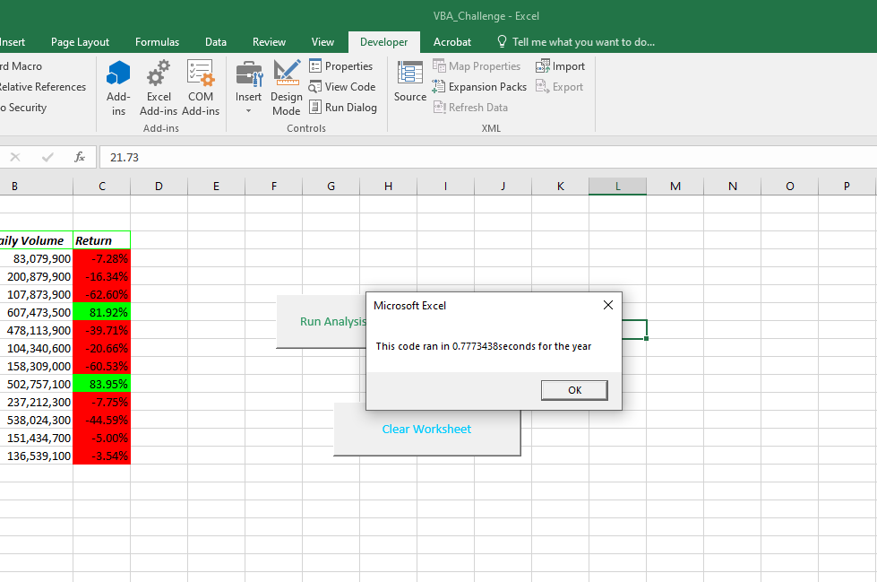
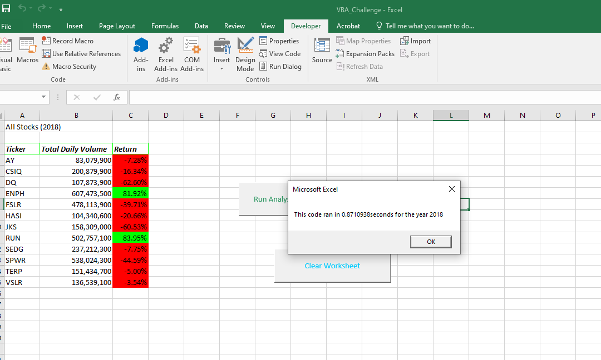

# Stock Analysis
The purpose of the following analysis is to compare Steves stocks from year 2017 to 2018 and total volume. Steves parents have invested in the DQ stock in particular and would like to see daily volume and annual volume to determine how often it gets traded. In the latest analysis, we are able to see significants drops in return vs daily volume.
## Results of Analysis
By analyzing the data and comparing 2017 vs 2018 return we can draw the conclusion that 2017 was by far a more successful year for return on investemnet for all stocks. Out of 12 total stocks, all but one was in the green (positive return) in 2017 as compared to only two had a positive return in 2018. 

## Summary
The DQ stock clearly had an outstanding year for Steves parents coming in at a 199.4% return in 2017. 
In addition, we learned that refactoring the code allowed for a more efficient way for Steve to see the results for an entire dataset in less than a second. Refactoring allows Steve to provide real time data, quickly and efficiently. 
